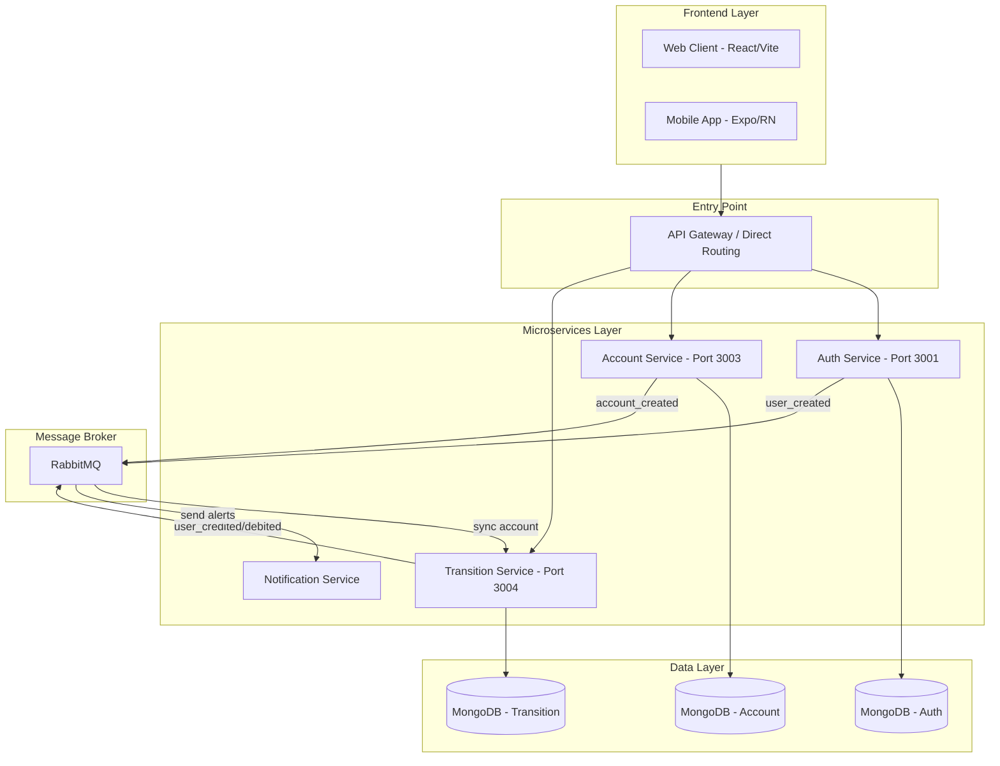
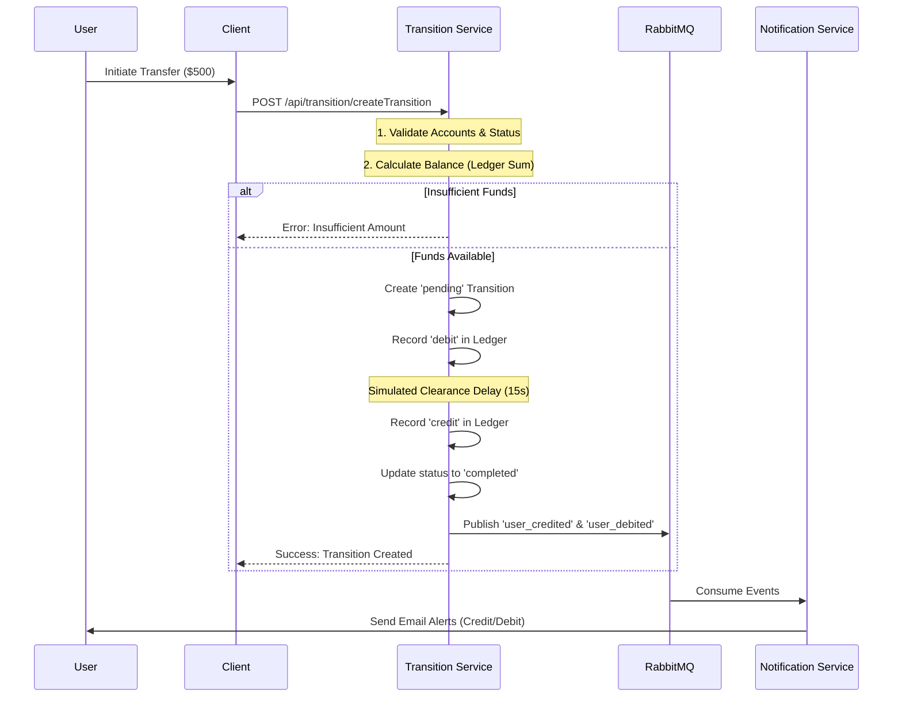

# 🚀 NeuroBank Technical Walkthrough

NeuroBank is a high-performance, microservices-based banking platform designed to simulate real-world fintech operations, including secure transactions, automated notifications, and distributed data consistency.

## 📐 System Architecture

NeuroBank follows a modern Microservices architecture, utilizing RabbitMQ for asynchronous event-driven communication and MongoDB for persistent storage per service.

## 🔄 The Transaction (Transition) Flow

When a user sends money, the system ensures atomicity and consistency through a multi-step ledger-based process:

## 🛠 Key Backend Implementations

### 1. Ledger-Based Accounting
Unlike simple balance updates, NeuroBank uses a **Ledger system**. The user's balance is calculated on-the-fly by summing up all credit and debit entries. This provides a robust audit trail and prevents common balance-update race conditions.

### 2. Event-Driven Data Sync
To avoid inter-service coupling, the **Transition Service** maintains a local copy of `Account` data. This data is kept in sync via RabbitMQ:
- When a new account is created in the **Account Service**, it publishes an `account.created` event.
- The **Transition Service** consumes this event and upserts the data into its local MongoDB.

### 3. Idempotency Support
The transaction system requires an `idempotencyKey` for every transfer. This ensures that even if a network retry occurs, the system will not process the same payment twice, protecting user funds.

### 4. Automated Notifications
The **Notification Service** is completely decoupled. It listens for various events (`user_created`, `user_credited`, etc.) and handles the complex logic of rendering HTML templates and dispatching emails via Nodemailer.

---
*Created as part of the NeuroBank Documentation.*
